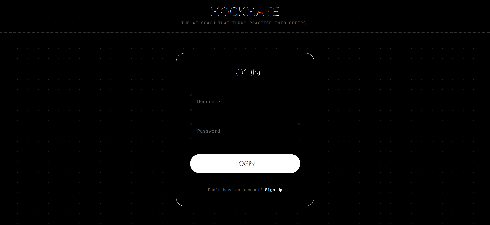
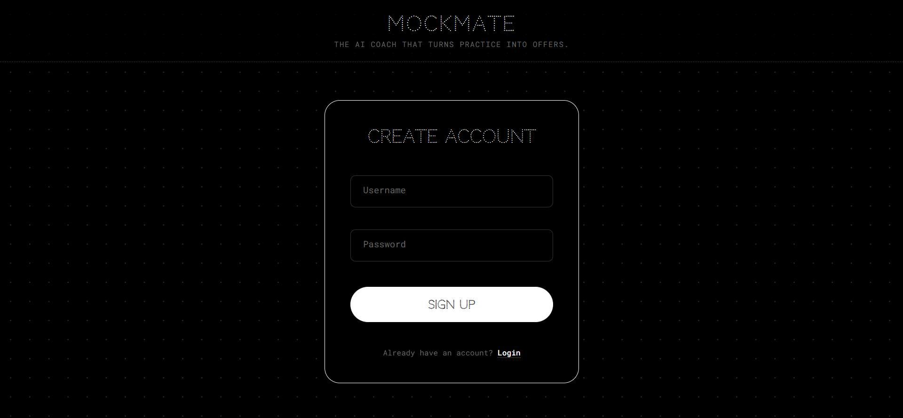
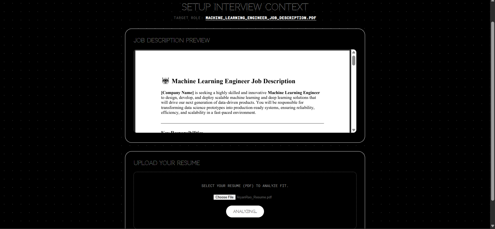
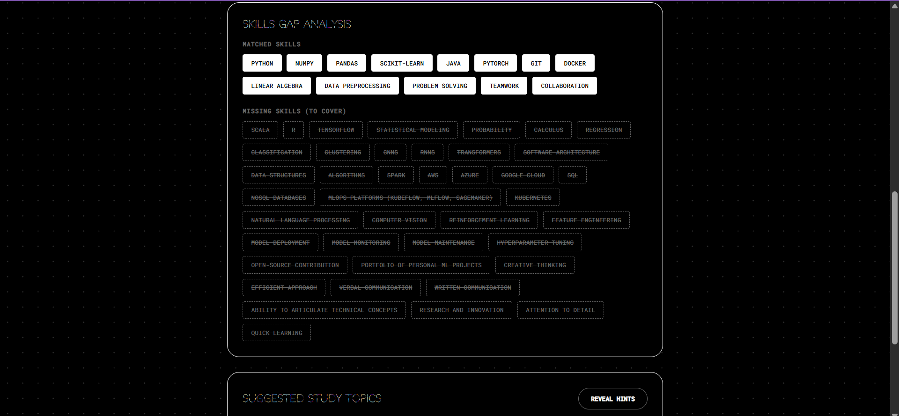
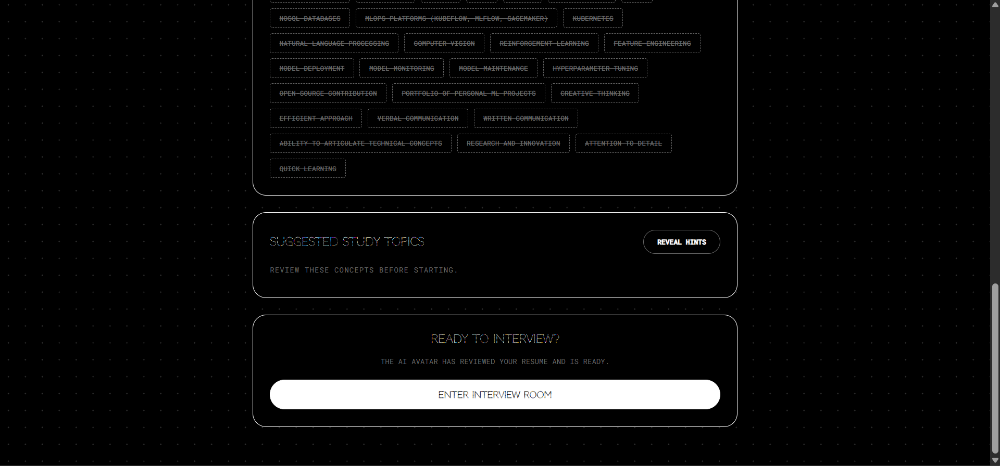
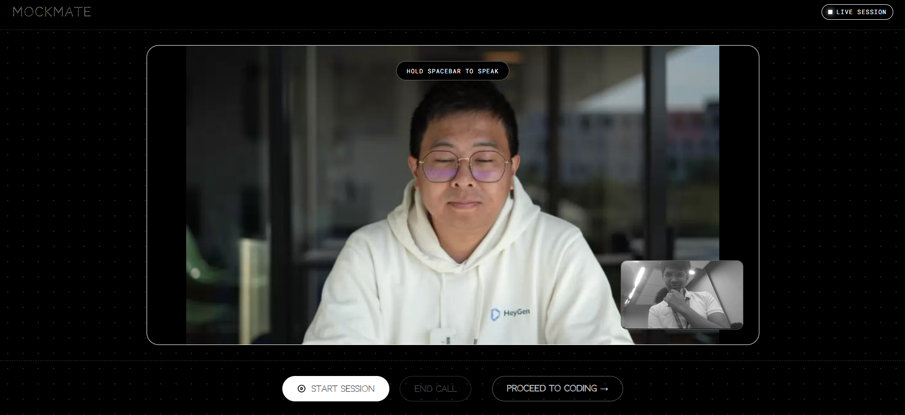
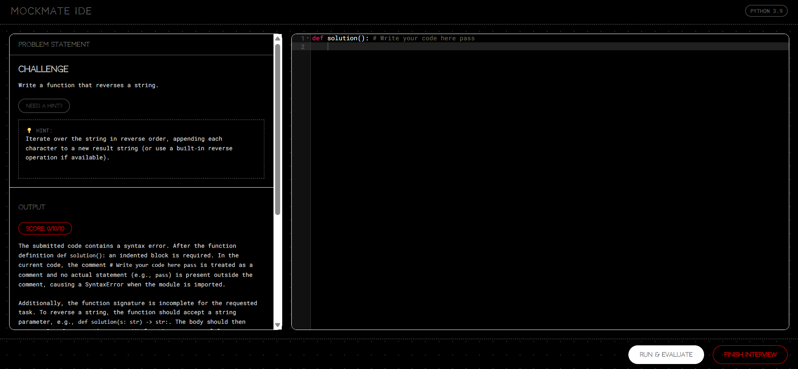
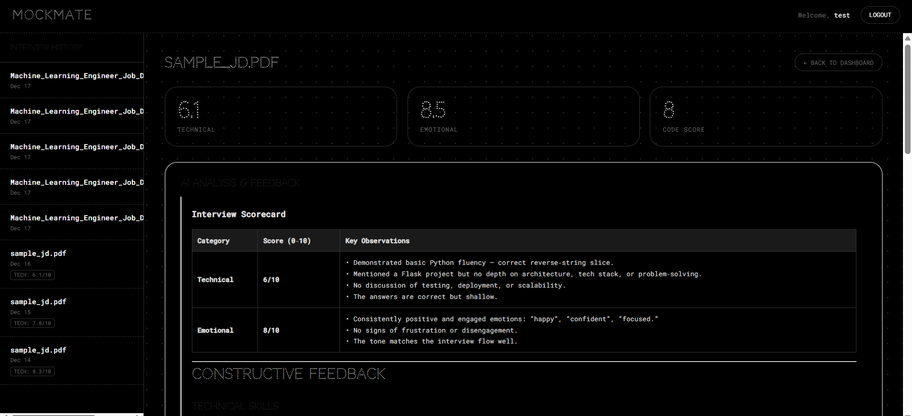
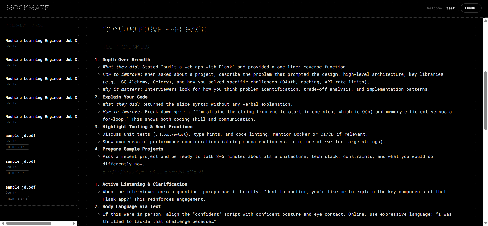
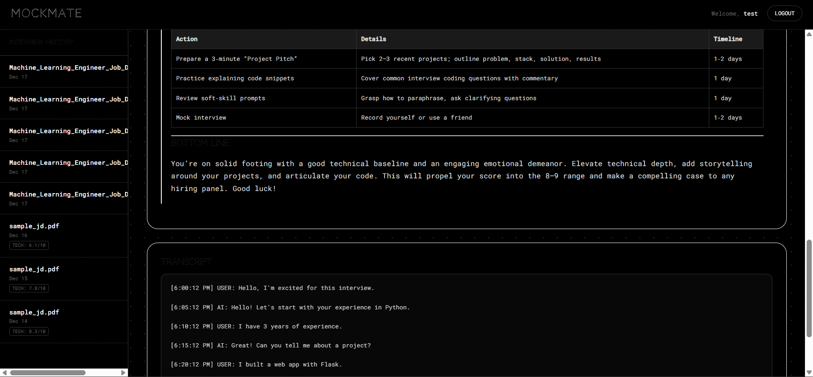

# MockMate

MockMate is an AI-powered mock interview platform designed to help users prepare for job interviews through interactive simulations. It leverages large language models (LLMs), emotion recognition, code evaluation, and avatar-based interactions to provide a comprehensive interview experience. The platform allows users to upload job descriptions (JDs) and resumes, analyze them for skills matching, engage in text-based or avatar-driven interviews, and receive real-time feedback on technical and emotional performance.

## Features

- **User Authentication**: Secure login and signup system with session management.
  
  
- **Job Description (JD) and Resume Upload**: Upload PDFs for JDs and resumes. Automatic text extraction using OCR (EasyOCR) when necessary, and skill analysis via LLMs.
- **JD Analysis**: Extract and analyze key skills, requirements, and content from uploaded JDs.
  
  
  
- **Mock Interviews**:
  - Text-based chat interviews with AI (using Ollama or Google Gemini).
  - Avatar-based interviews integrated with Heygen API for visual interactions.
    
  - Real-time emotion detection using webcam feed (via FER library).
  - Code evaluation for programming questions, with syntax, logic, and correctness checks.
    
- **Evaluation and Feedback**: Automated scoring for technical and emotional aspects, stored in a SQLite database.
- **Dashboard**: View uploaded JDs, resumes, analysis results, and interview history.
  
  
  
- **API Endpoints**: RESTful APIs for chat, evaluation, file uploads, and more.
- **Multi-Model LLM Support**: Switch between Ollama (local) and Google Gemini for AI interactions.

## Technologies Used

- **Backend**: Flask (Python web framework)
- **Database**: SQLite
- **LLMs**: LangChain integration with Ollama and Google Gemini
- **Emotion Detection**: FER (Facial Emotion Recognition)
- **OCR**: EasyOCR for text extraction from PDFs
- **PDF Processing**: PyMuPDF (Fitz)
- **Image Processing**: OpenCV, Pillow
- **Speech Processing**: Faster-Whisper (for potential future audio features)
- **Frontend**: HTML templates with Jinja2 (Flask's default)
- **Other**: NumPy, Requests, Python-dotenv

## Prerequisites

- Python 3.8 or higher
- Ollama installed and running locally (for local LLM support). Download from [ollama.ai](https://ollama.ai/).
- Webcam access (for emotion detection)
- API keys for external services (see Environment Variables below)

## Installation

1. **Clone or Download the Repository**:

   - Place the project in your desired directory, e.g., `c:\Users\MyUserName\mockmate`.

2. **Install Dependencies**:

   - Navigate to the project root directory.
   - Run the following command to install required Python packages:
     ```
     pip install -r [requirements.txt](http://_vscodecontentref_/0)
     ```

3. **Set Up Environment Variables**:

   - Create a `.env` file in the project root directory.
   - Add the following variables (replace with your actual keys):
     ```
     SECRET_KEY=your_secret_key_here
     HEYGEN_API_KEY=your_heygen_api_key
     HEYGEN_AVATAR_ID=your_heygen_avatar_id
     GOOGLE_API_KEY=your_google_api_key
     OLLAMA_CHAT_MODEL=gpt-oss:20b-cloud  # or your preferred Ollama model
     OLLAMA_TOOL_MODEL=gpt-oss:20b-cloud
     OLLAMA_BASE_URL=http://localhost:11434
     GOOGLE_CHAT_MODEL=gemini-2.5-flash
     ```
   - Note: `SECRET_KEY` is for Flask session security. API keys are for Heygen (avatar service) and Google Gemini. Ollama settings default to local setup.

4. **Initialize the Database**:
   - The database (`instance/chat.db`) and upload folders are created automatically on first run. No manual setup needed.

## Running the Application

1. **Start Ollama (if using local LLMs)**:

   - Ensure Ollama is running with your desired models pulled (e.g., `ollama pull gpt-oss:20b-cloud`).

2. **Run the App**:

   - From the project root, execute:
     ```
     python [run.py](http://_vscodecontentref_/1)
     ```
   - The app will start on `http://localhost:5000` in debug mode.
   - On first run, it will initialize the database tables.

3. **Access the Application**:
   - Open a web browser and go to `http://localhost:5000`.
   - Sign up for a new account or log in.
   - Upload a JD and resume, analyze them, and start a mock interview.

## Usage

1. **Sign Up/Login**: Create an account or log in to access the dashboard.
   
   
2. **Upload JD**: Go to the dashboard, upload a PDF JD. The system will extract text and analyze skills.
   
3. **Upload Resume**: Upload a resume PDF linked to the JD for comparison.
4. **Start Interview**: Choose between text chat or avatar mode. Answer questions, and the system will evaluate your responses.
   
   
5. **View Results**: Check scores, feedback, and history on the dashboard.
   
   
   
   
   

## API Endpoints

- `POST /api/chat`: Send chat messages for interview simulation.
- `POST /api/evaluate`: Evaluate user responses for scores.
- `POST /api/upload_jd`: Upload and analyze JD.
- `POST /api/upload_resume`: Upload resume.
- `GET /api/sessions`: Retrieve interview sessions.
- Other endpoints for auth, dashboard, and interview flows.

Refer to [app/routes/api.py](app/routes/api.py) for full details.

## Testing

- Run tests with:

```
  python -m pytest tests/
```

- Current tests include session API tests in [tests/test_sessions_api.py](tests/test_sessions_api.py).

## Screenshots

The following screenshots showcase key features of MockMate:

- 
- 
- 
- 
- 
- 
- 
- 
- 
- 

## Contributing

- Fork the repository and submit pull requests.
- Ensure code follows PEP 8 style.
- Add tests for new features.

## License

This project is licensed under the MIT License. See LICENSE file for details (if added).

## Troubleshooting

- **LLM Errors**: Ensure Ollama is running or Google API key is valid.
- **Emotion Detection**: Grant webcam permissions in your browser.
- **OCR Issues**: For PDFs with images, ensure CUDA is available if using GPU for EasyOCR.
- **Database Errors**: Delete `instance/chat.db` to reset (data will be lost).
- **Port Conflicts**: Change port in `run.py` if 5000 is in use.

For more help, check the code comments or open an issue.

---

_Last updated: December 17, 2025_
